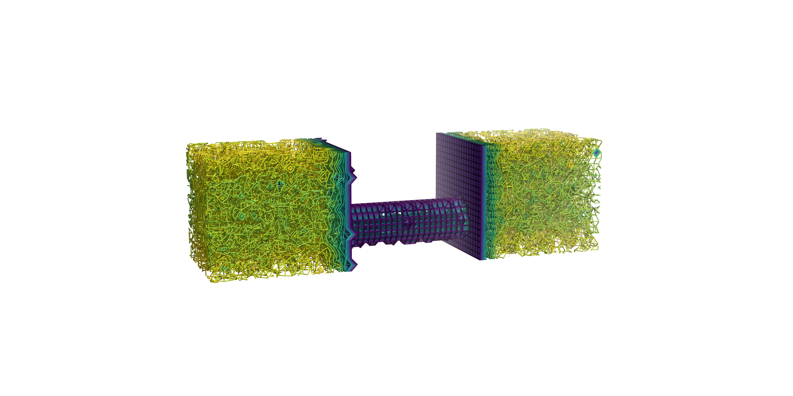
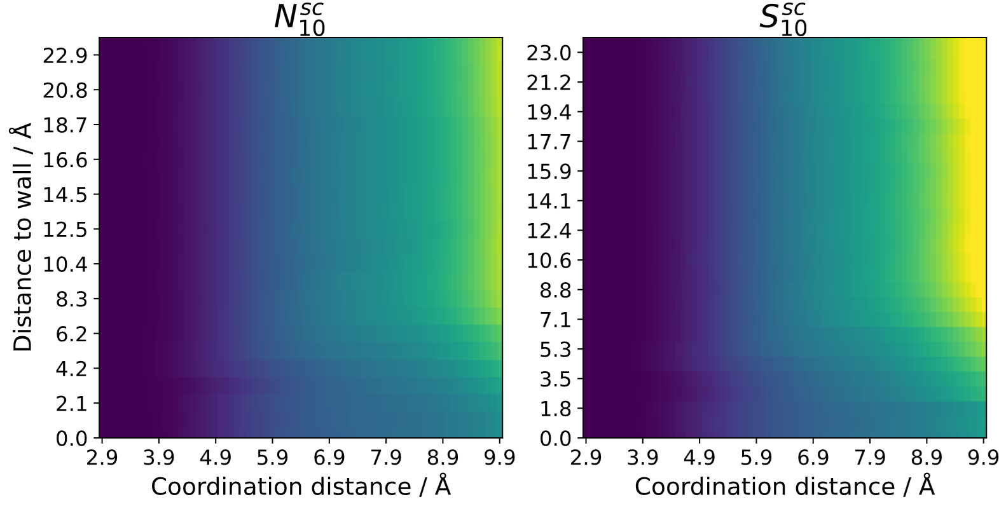
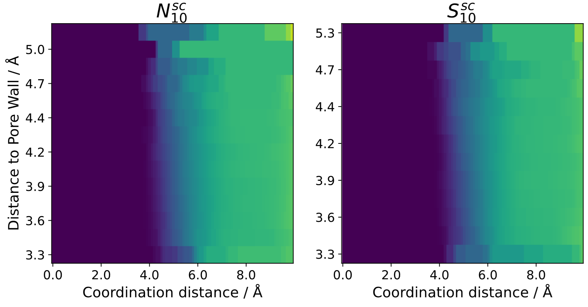

Coordination number analysis
============================

This analysis calculates the coordination number by calculating by simple counting of neighbors. The result
is identical to an rdf integral.

3D coordination number
----------------------

The result of the analysis can be performed on a user-defined grid and printed as a gaussian cube file.
Each 3D-bin will contain the coordination number up to the specified coordination distance. The output is
split into different cube files for each species pair (not including species identified or defined as structures).
The cube files can be visualized to get a 3d map of the coordination number (by using e.g. VMD, PyMol etc.). This can
be helpfule to recognize regions of interest in highly anisotropic systems:

distance-dependence to structures
---------------------------------

If no 3D-analysis is conducted, the coordination number can be calculated relative to structures. For any kind
of structure, a 2D-heatmap can be generated where one axis contains the coordination distance and the other axis contains
the distance to a reference structure. This can be utilized to see trends in transition regions going from surfaces
to bulk liquid. Here is an example comparing a neat ionic liquid at a carbon surface to a system with added salt [1]_:

If the system contains a porous material (e.g. nanopore) the coordination number can also be calculated inside
of the pores relative to the inner pore walls:

Note that this either needs really large pores or long simulation times to yield sufficient sampling, as there
are usually not many atoms present inside of nanopores when compares to bulk liquid.

.. note::
        example pictures taken from ref [1] [1]_.
.. [1] L. Dick,K. Buchmüller,B. Kirchner, Coordination behavior of a confined ionic liquid in carbon nanotubes from molecular dynamics simulations. J Phys Chem B. 128 (18) (2024) 4472-4484.
    DOI: doi.org/10.1021/acs.jpcb.3c08493
